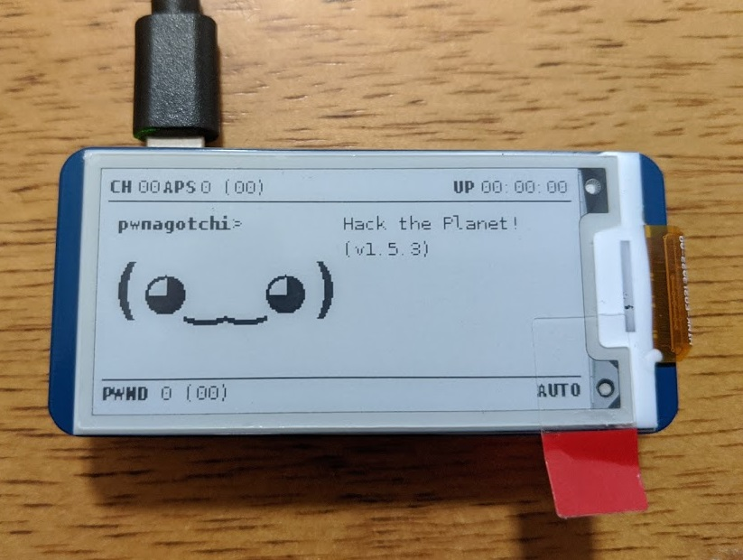
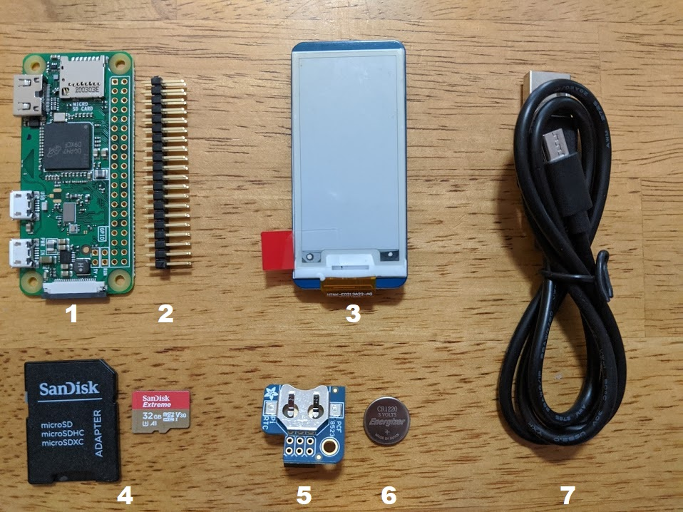

# How to Build a Pwnagotchi Step-By-Step
###### Date: 8/22/2020 | Project title: Fake B*tch

## What is Pwnagotchi?
Pwnagotchi is a handheld digital pet for hacking Wi-Fi that gets smarter as it visits more Wi-Fi networks. Pwnagotchi learns by capturing Wi-Fi messages while their owner takes them for walks. Pwnagotchi is a fun hacking project that can be built with a simple Raspberry Pi Zero. 

## How does it work?
Pwnagotchi is an A2C-based “AI” powered by bettercap that learns from its surrounding WiFi environment in order to maximize the crackable WPA key material it captures (either through passive sniffing or by performing deauthentication and association attacks). This material is collected on disk as PCAP files containing any form of crackable handshake supported by hashcat, including full and half WPA handshakes as well as PMKIDs.

# Materials

- [ ] [Raspberry Pi Zero W](https://www.raspberrypi.org/products/raspberry-pi-zero-w/)

- [ ] [40-Pin (2 x 20) Male Header](https://www.amazon.com/Frienda-Break-Away-Connector-Compatible-Raspberry/dp/B083DYVWDN/ref=sr_1_5?dchild=1&keywords=40-Pin+%282+x+20%29+Male+Header&qid=1598122986&sr=8-5)

- [ ] [Waveshare eInk 2.13” Display HAT V2 (250x122)](https://www.amazon.com/gp/product/B07P9T64BK/ref=ppx_yo_dt_b_asin_title_o02_s00?ie=UTF8&psc=1)

- [ ] [SanDisk 32GB microSD card with (rated UHS-I or above)](https://www.amazon.com/gp/product/B06XWMQ81P/ref=ppx_yo_dt_b_asin_title_o01_s00?ie=UTF8&psc=1) 

- [ ] [Adafruit PiRTC PCF8523 Real Time Clock](https://www.amazon.com/Adafruit-PiRTC-PCF8523-Raspberry-ADA3386/dp/B072DWKDW9/ref=sr_1_2?dchild=1&keywords=PiRTC&qid=1598123293&s=electronics&sr=1-2) 

- [ ] [CR1220 3V Lithium Coin Cell Battery](https://www.amazon.com/Energizer-CR1220-Drain-lithuim-Battery/dp/B003CU3E2Q/ref=pd_bxgy_img_2/131-4843813-0186558?_encoding=UTF8&pd_rd_i=B003CU3E2Q&pd_rd_r=40337046-8cdb-49fe-9740-c4c6ea91b4cb&pd_rd_w=Eg4Kz&pd_rd_wg=hBgCj&pf_rd_p=ce6c479b-ef53-49a6-845b-bbbf35c28dd3&pf_rd_r=W8GD07CM886MWRTMX320&psc=1&refRID=W8GD07CM886MWRTMX320) 

- [ ] [Any USB to Micro USB cable (must support data transfer)]() 

- [ ] [Pisugar Portable 1200 mAh Lithium Battery for Raspberry Pi Zero](https://www.amazon.com/gp/product/B07RC649ZC/ref=ppx_yo_dt_b_asin_title_o00_s00?ie=UTF8&psc=1) 
