# How to Build a Pwnagotchi Step-By-Step
###### Date: 8/22/2020 | Project title: Jeff's Pwnagotchi

## What is Pwnagotchi?
Pwnagotchi is a handheld digital pet for hacking Wi-Fi that gets smarter as it visits more Wi-Fi networks. Pwnagotchi learns by capturing Wi-Fi messages while their owner takes them for walks. Pwnagotchi is a fun hacking project that can be built with a simple Raspberry Pi Zero. 

## How does it work?
Pwnagotchi is an A2C-based “AI” powered by bettercap that learns from its surrounding WiFi environment in order to maximize the crackable WPA key material it captures (either through passive sniffing or by performing deauthentication and association attacks). This material is collected on disk as PCAP files containing any form of crackable handshake supported by hashcat, including full and half WPA handshakes as well as PMKIDs.

# Materials Needed

1. [Raspberry Pi Zero W](https://www.raspberrypi.org/products/raspberry-pi-zero-w/)

2. [40-Pin (2x20) Male Header](https://www.amazon.com/Frienda-Break-Away-Connector-Compatible-Raspberry/dp/B083DYVWDN/ref=sr_1_5?dchild=1&keywords=40-Pin+%282+x+20%29+Male+Header&qid=1598122986&sr=8-5)

3. [Waveshare eInk 2.13” 250x122 Display HAT V2](https://www.amazon.com/gp/product/B07P9T64BK/ref=ppx_yo_dt_b_asin_title_o02_s00?ie=UTF8&psc=1)

4. [SanDisk 32GB microSD (rated UHS-I or above)](https://www.amazon.com/gp/product/B06XWMQ81P/ref=ppx_yo_dt_b_asin_title_o01_s00?ie=UTF8&psc=1) 

5. [Adafruit PiRTC PCF8523 Real Time Clock](https://www.amazon.com/Adafruit-PiRTC-PCF8523-Raspberry-ADA3386/dp/B072DWKDW9/ref=sr_1_2?dchild=1&keywords=PiRTC&qid=1598123293&s=electronics&sr=1-2) 

6. [CR1220 3V Lithium Coin Cell Battery](https://www.amazon.com/Energizer-CR1220-Drain-lithuim-Battery/dp/B003CU3E2Q/ref=pd_bxgy_img_2/131-4843813-0186558?_encoding=UTF8&pd_rd_i=B003CU3E2Q&pd_rd_r=40337046-8cdb-49fe-9740-c4c6ea91b4cb&pd_rd_w=Eg4Kz&pd_rd_wg=hBgCj&pf_rd_p=ce6c479b-ef53-49a6-845b-bbbf35c28dd3&pf_rd_r=W8GD07CM886MWRTMX320&psc=1&refRID=W8GD07CM886MWRTMX320) 

7. [USB to Micro USB cable (must support data transfer)]() 

8. [Pisugar Portable Battery for Raspberry Pi Zero (not pictured)](https://www.amazon.com/gp/product/B07RC649ZC/ref=ppx_yo_dt_b_asin_title_o00_s00?ie=UTF8&psc=1) 

# Tools Needed

1. [Lead-free Rosin Core Solder]()

2. [No-Clean Solder Wick]()

3. [Saftey Glasses]()

4. [Tweezers]()

5. [22 Gauge Electrical Wire]()

6. [Soldering station]()

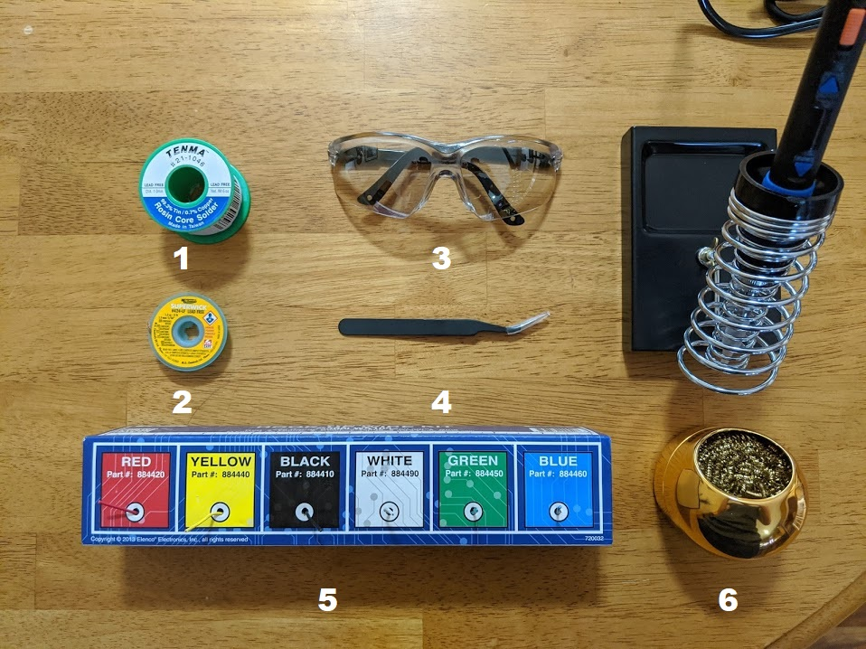

# Building the Pwnagotchi

## Step 1: Place the headers onto the raspberry pi

## Step 2: Carefully solder the headers onto the raspberry pi

## Step 3: Plug the Waveshare display into the raspberry pi

## Step 4: Prepare the PiRTC to be put onto the raspberry pi

## Step 5: Carefully solder the wires onto the PiRTC

## Step 6: Carefully solder the PiRTC onto the raspberry pi

## Step 7: Attach the Pisugar battery to the raspberry pi

#### Finished! Now you are ready to begin flashing the microSD card

# Installing the Pwnagotchi software

## Step 1: Grab your microSD card and plug it into your computer

## Step 2: Download the Pwnagotchi zip file

## Step 3: Unzip the Pwnagotchi zip file
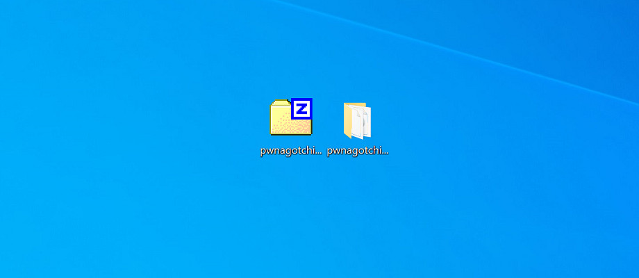

## Step 4: Open balenaEtcher and click "Flash from file"
(or your choice of microSD card flasher)
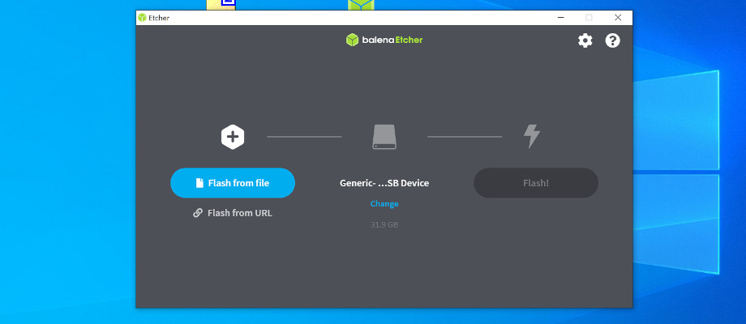

## Step 5: Select the .img file from the folder you unzipped in step 3 
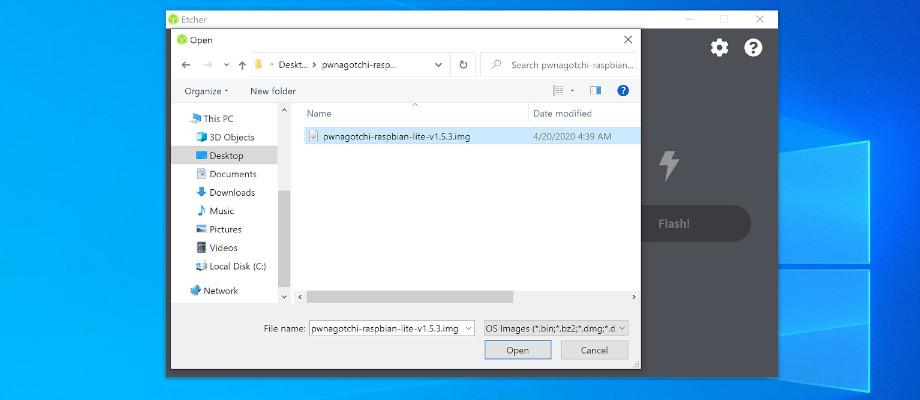

## Step 6: Click "Select target"
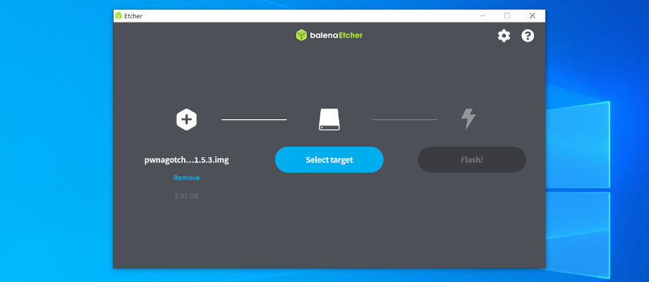

## Step 7: Check the box with your microSD card and click "Select"

## Step 8: Review the settings and then click "Flash"
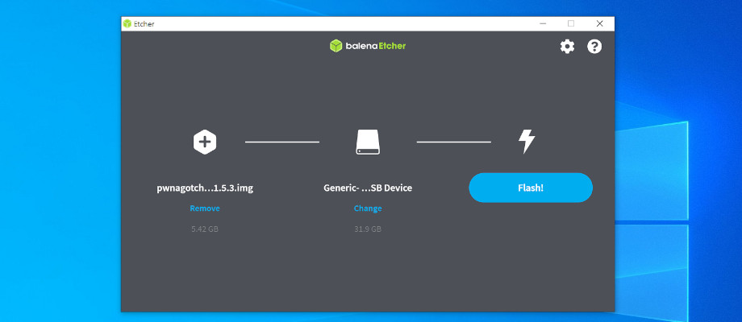

## Step 9: Wait for the program to finish flashing your microSD card
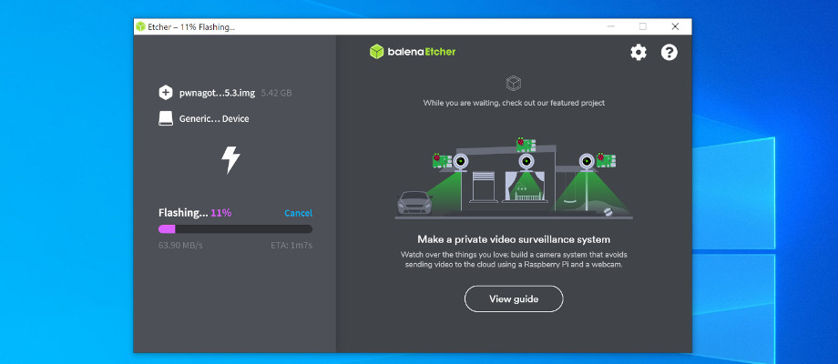

## Step 10: On your desktop, create a new text file and rename it  "config.toml"

## Step 11: Copy the config template from the Pwnagotchi site and edit the settings to your liking. 
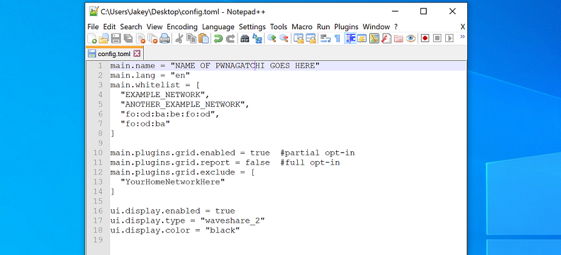

## Step 12: Once you are finished editing the config.toml, copy the file to the root directroy of your microSD card.
Make sure that you are placing a COPY of the file onto the microSD card. The pwnagotchi will delete the file everytime it boots up. So make sure you have a copy. If your microSD card does not show up in your file explorer, unplug it and plug it back in. Then it should show up.
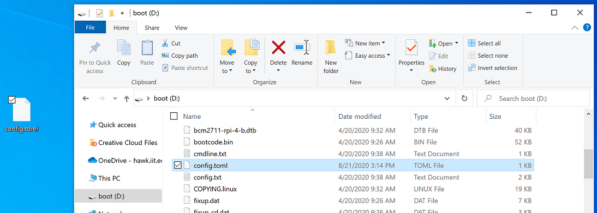

## Step 13: Grab your raspberry pi and your microSD card

## Step 14: Carefully place your microSD card into the raspberry pi's SD card slot 

## Step 15: Power on the raspberry pi 
Make sure to plug the USB cable into the port on the LEFT. The micro USB port on the left is the power port and is for normal use. The micro USB port on the right is the maintenance port and is used to retrieve data from your pwnagotchi. 

## Step 16: Wait for the raspberry pi to power on. You should see a green indicator light start flashing.

## Step 17: Once it's powered up, DO NOT TURN OFF. Wait for the first-boot initialization to finish.
Make sure that you DO NOT INTERRUPT the first-boot initialization. This step could take a while to finish. When it is done, the message will change.   
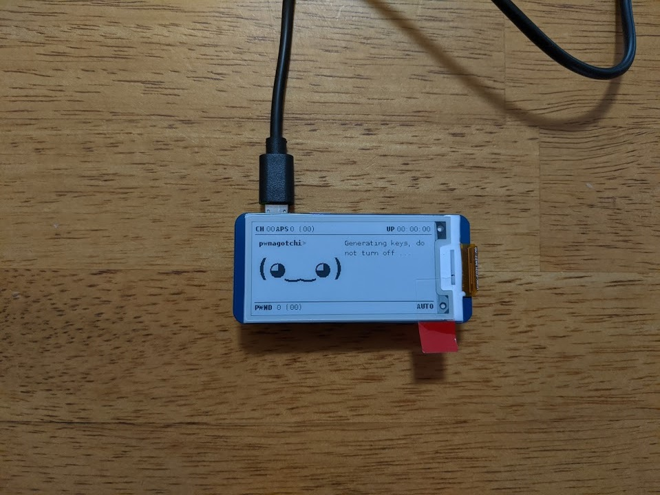

#### FINISHED!
Congratulations, you are now finished building the pwnagotchi. Check out the [pwnagotchi official website](https://pwnagotchi.ai/) to learn how to use your new digital pet. 
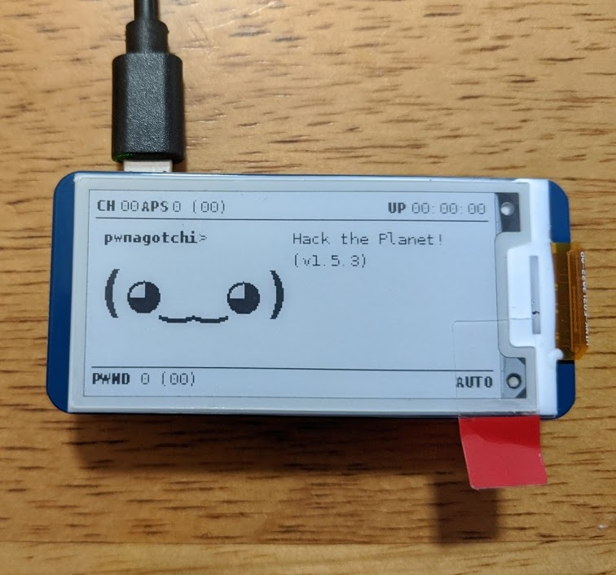

